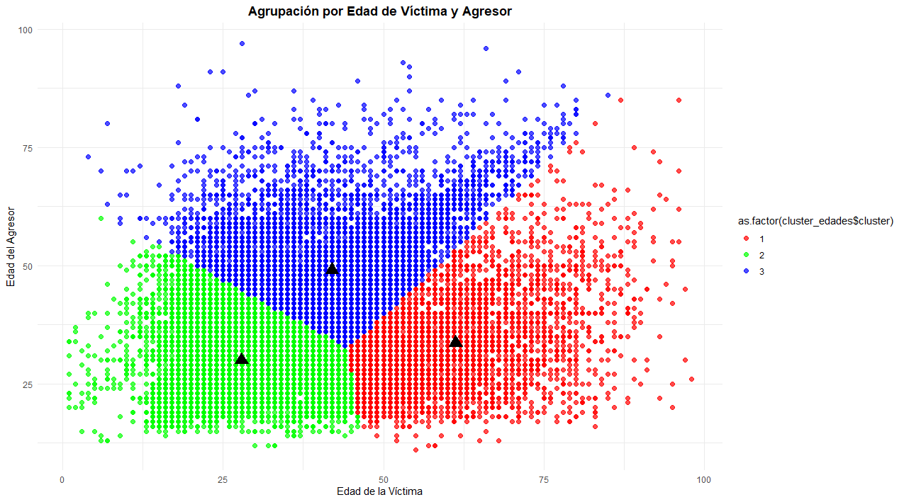

# Análisis de Patrones de Agrupación con Clúster K-Means  
**Dataset:** Violencia Intrafamiliar 2024  
[Violencia intrafamiliar año 2024](https://datos.ine.gob.gt/dataset/violencia-intrafamiliar/resource/73875737-52c9-41b3-accf-37b44e534bec)
---

## 📘 Introducción  
El presente análisis aplica el algoritmo **K-Means** sobre los datos del **Instituto Nacional de Estadística** de Guatemala, correspondientes a reportes de **violencia intrafamiliar durante el año 2024**. El objetivo del estudio es identificar **patrones de agrupación entre las edades de las víctimas y de los agresores**, con el fin de observar tendencias generacionales y tipos de relación que se asocian con los casos registrados.  

El modelo se configuró con **3 clústeres** y las variables principales fueron:
- Edad de la víctima (`VIC_EDAD`)  
- Edad del agresor (`AGR_EDAD`)  

---

## 🔴 Clúster 1 – Parejas adultas mayores  
**Centro aproximado:**  
 - Víctima de aprox 55 años 
 - Agresor aprox 45 años  

**Interpretación:**  
El clúster representa situaciones de **violencia en relaciones prolongadas o de convivencia de larga duración**, posiblemente matrimonios o parejas adultas con alta dependencia emocional o económica.

---

## 🟢 Clúster 2 – Parejas jóvenes  
**Centro aproximado:**  
 - Víctima de aprox 25 años 
 - Agresor aprox 25 años   

**Interpretación:**  
Este grupo representa **relaciones recientes o de corta convivencia**, donde la violencia suele estar relacionada con **celos, control o falta de estabilidad emocional**.  

---

## 🔵 Clúster 3 – Diferencia generacional  
**Centro aproximado:**  
 - Víctima de aprox de 25 a 40 años 
 - Agresor aprox 45 a 60 años  

**Interpretación:**  
Este clúster puede estar vinculado a situaciones de **violencia intergeneracional o de autoridad**, como padres, tutores o familiares mayores hacia víctimas jóvenes.  
También puede representar relaciones asimétricas donde la diferencia de edad conlleva **desequilibrio de poder o dependencia económica**, lo que incrementa la vulnerabilidad de la víctima.

---

## 📬 Resultados  

