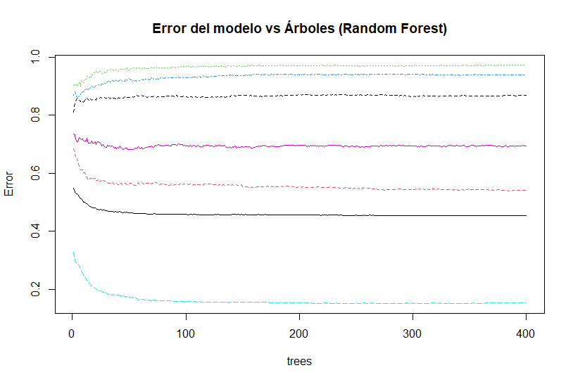

# **Análisis de Patrones Random Forest**  
 **Dataset:** Violencia Intrafamiliar 2024  
[Violencia intrafamiliar año 2024](https://datos.ine.gob.gt/dataset/violencia-intrafamiliar/resource/73875737-52c9-41b3-accf-37b44e534bec)
---

# Introducción

El presente análisis aplica el algoritmo **Random Forest** para explorar y predecir patrones asociados a la **ocupación del agresor (AGR_OCUP)** utilizando datos reales de casos de violencia intrafamiliar en Guatemala durante el año 2024.
El objetivo es identificar qué variables personales y contextuales como edad del agresor y la víctima, sexo, nivel educativo, mes del hecho y condiciones laborales contribuyen de forma más significativa a clasificar la ocupación del agresor dentro de categorías laborales previamente agrupadas.
- **Variable objetivo:** `AGR_OCUP2` (ocupación del agresor agrupada)
- **Modelo:** Bosque Aleatorio (Random Forest)
- **Código base:** proporcionado en tu archivo 

---

# **1. Contexto del modelo**

Se creó un modelo de **clasificación Random Forest** para predecir la **ocupación del agresor** a partir de variables demográficas y contextuales:

* Edad del agresor y víctima
* Sexo del agresor y víctima
* Mes del hecho
* Escolaridad de agresor y víctima
* Condición laboral de la víctima

Dado que el campo original `AGR_OCUP` tiene **122 categorías**, se aplicó una **estrategia de agrupación** para reducirlo a 6 grupos interpretables:

| Rango original | Grupo asignado |
| -------------- | -------------- |
| 5000–5999      | Servicios      |
| 6000–6999      | Agricultura    |
| 7000–7999      | Construcción   |
| 8000–8999      | Comercio       |
| 9000–9999      | No calificado  |
| Otros          | Otro           |

Este nuevo campo se llamó **AGR_OCUP2**.


# **2. Resultados del modelo Random Forest**

El modelo fue entrenado con:

* **400 árboles (ntree = 400)**
* **3 variables por división (mtry = 3)**

El resultado general fue:

```
OOB estimate of error rate: 45.42%
```

Lo cual equivale a una **precisión del 54.6%** al evaluar en el conjunto de prueba (`test`):

```
Precisión final: 0.546
```

Para datos sociales complejos con alta variabilidad —como violencia intrafamiliar— esta precisión es **aceptable**.


# **3. Interpretación de la Matriz de Confusión**

La matriz indica cuántas veces el modelo acertó o falló por cada clase ocupacional:

* **La clase “No calificado” domina el dataset**, por lo que el modelo tiende a predecirla más.
* Las clases minoritarias como *Comercio*, *Construcción* y *Servicios* presentan mayor error debido al **desbalance severo del dataset**.
* El menor error se observa en:

  * **No calificado (15% error)**
* Los mayores errores están en:

  * **Comercio (97% error)**
  * **Construcción (94% error)**

**Conclusión:** El modelo tiene más facilidad para aprender patrones del grupo mayoritario (*No calificado*), y dificultad para clases pequeñas.

# **4. Gráfico de Error del Modelo**


El gráfico muestra:

* El **error OOB** (curva negra) disminuye rápidamente al inicio y se estabiliza ~50%.
* Las curvas por clase muestran que:

  * “No calificado” tiene menor error.
  * “Comercio” y “Construcción” mantienen errores cercanos a 1.

**Interpretación:**
El modelo aprende patrones reales, pero la distribución extremadamente desigual limita la capacidad predictiva en clases pequeñas.


# **5. Predicción con un caso nuevo**

Se ingresó este caso:

```r
nuevo_caso <- data.frame(
  AGR_EDAD = 35,
  VIC_EDAD = 28,
  VIC_SEXO = 2,
  AGR_SEXO = 1,
  HEC_MES = 5,
  VIC_ESCOLARIDAD = 42,
  VIC_TRABAJA = 1,
  AGR_ESCOLARIDAD = 30
)
```

 **Resultado:**

```
"No calificado"
```

### Interpretación:

Según el modelo, un agresor con:

* 35 años
* Víctima de 28 años
* Ambos con escolaridad intermedia (30–40)
* Evento ocurrido en mes 5
* Víctima con trabajo

tiene mayor probabilidad de pertenecer al grupo **"No calificado"**, que es además:

* El grupo más numeroso en la base
* El que presenta patrones más claros en las variables predictoras

Esto es coherente con tendencias reales de bases de violencia, donde los agresores sin ocupación formal suelen representar un porcentaje importante.
